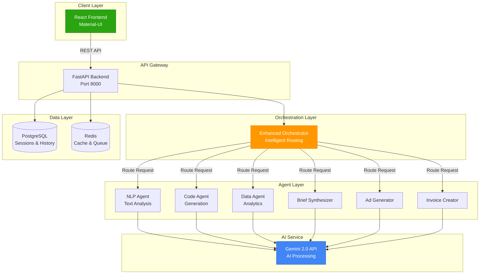
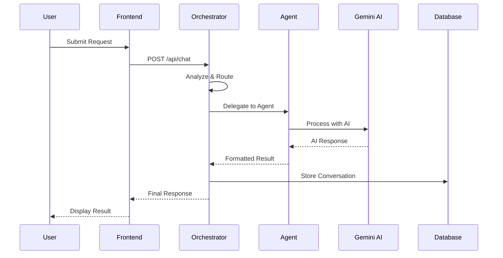

#  Akcero Multi-Agent AI Platform

<div align="center">


**A sophisticated collaborative multi-agent system designed for intelligent task specialization and seamless cross-domain problem solving.**

[Getting Started](#-quick-start) • [Architecture](#-architecture) • [Features](#-features) • [Documentation](#-documentation)

</div>

---

##  Table of Contents

- [Overview](#-overview)
- [Architecture](#-architecture)
- [Key Features](#-features)
- [Technology Stack](#-technology-stack)
- [Quick Start](#-quick-start)
- [Usage Guide](#-usage-guide)
- [Project Structure](#-project-structure)
- [API Documentation](#-api-documentation)
- [Contributing](#-contributing)

---

##  Overview

The **Akcero Multi-Agent AI Platform** is an enterprise-grade solution that leverages specialized AI agents to handle diverse tasks through a unified interface. Built with modern web technologies and powered by Google's Gemini AI, the platform intelligently routes user requests to the most appropriate agent, ensuring optimal results across natural language processing, code generation, and data analysis domains.


---

##  Architecture

### System Overview



### Request Flow



---

##  Features

###  Specialized AI Agents

| Agent | Capabilities | Use Cases |
|-------|-------------|-----------|
| **NLP Agent** | Sentiment analysis, text summarization, content review | Customer feedback analysis, document processing |
| **Code Agent** | Code generation, debugging, best practices | Algorithm implementation, code review |
| **Data Agent** | Statistical analysis, visualization, ML guidance | Business intelligence, data exploration |
| **Brief Synthesizer** | Marketing strategy, positioning, campaign planning | Brand strategy, go-to-market plans |
| **Ad Generator** | Creative copy, A/B variations, brand compliance | Marketing campaigns, social media |
| **Invoice Creator** | Professional invoices, PDF export | Billing, client invoicing |

###  Core Capabilities

- **Intelligent Routing**: Advanced scoring algorithm automatically selects the optimal agent
- **File Processing**: Upload and analyze documents, code files, datasets
- **Session Management**: Persistent chat history with multi-session support
- **Real-time Status**: Live agent activity monitoring
- **Fallback Responses**: Graceful degradation when AI services are unavailable
- **Enterprise Features**: Production-ready with monitoring, logging, health checks

###  User Experience

- Modern dark theme interface with Akcero branding
- Responsive design for desktop and mobile
- Markdown rendering with syntax highlighting
- Code block copy functionality
- File drag-and-drop upload
- Session history with search

---

##  Technology Stack

### Backend
- **FastAPI** - High-performance Python API framework
- **SQLAlchemy** - Database ORM with PostgreSQL
- **Redis** - Caching and session management
- **Celery** - Background task processing
- **Gemini 2.0 Flash Lite** - Google's latest AI model

### Frontend
- **React 18** - Modern UI framework
- **Material-UI (MUI)** - Enterprise component library
- **Axios** - HTTP client
- **React Markdown** - Rich text rendering

### Infrastructure
- **Docker & Docker Compose** - Containerization
- **PostgreSQL 15** - Primary database
- **Nginx** - Reverse proxy (production)
- **Prometheus & Grafana** - Monitoring (optional)

---

##  Quick Start

### Prerequisites

- Docker Desktop (version 20.10+)
- Docker Compose (version 2.0+)
- Gemini API Key ([Get one here](https://aistudio.google.com/app/apikey))
- 4GB RAM minimum, 8GB recommended

### Installation Steps

1. **Clone the Repository**
```bash
git clone https://github.com/yourusername/multi-agent-platform.git
cd multi-agent-platform
```

2. **Configure Environment Variables**

Create a `.env` file in the project root:

```bash
# Required: Gemini API Configuration
GEMINI_API_KEY=your_gemini_api_key_here

# Optional: LangChain Tracing
LANGCHAIN_API_KEY=your_langchain_key_here
LANGCHAIN_TRACING_V2=true
LANGCHAIN_PROJECT=multi-agent-platform

# Database (default values)
POSTGRES_DB=agent_platform
POSTGRES_USER=agent_user
POSTGRES_PASSWORD=agent_password
```

3. **Start the Platform**

```bash
# Build and start all services
docker-compose up --build

# Or run in detached mode
docker-compose up -d --build
```

4. **Access the Application**

- **Frontend**: http://localhost:3000
- **API Documentation**: http://localhost:8000/docs
- **Health Check**: http://localhost:8000/health

5. **Verify Installation**

```bash
# Check running containers
docker-compose ps

# View logs
docker-compose logs -f backend
docker-compose logs -f frontend
```

### Stopping the Platform

```bash
# Stop all services
docker-compose down

# Stop and remove volumes (clears database)
docker-compose down -v
```

---

##  Usage Guide

### Creating Your First Chat

1. Navigate to http://localhost:3000
2. Click "New Chat" to start a conversation
3. Type your request or upload a file
4. Watch as the orchestrator routes to the appropriate agent
5. Review the response with syntax highlighting and formatting

### Example Queries

**NLP Agent:**
```
Analyze the sentiment of this customer review: "The product exceeded my expectations!"
```

**Code Agent:**
```
Write a Python function to calculate fibonacci numbers with memoization
```

**Data Agent:**
```
Help me perform exploratory data analysis on a sales CSV file
```

**Brief Synthesizer:**
```
Create a go-to-market strategy for a SaaS product targeting small businesses
```

**Ad Generator:**
```
Generate 3 ad variations for a fitness app launch campaign
```

**Invoice Creator:**
```
Create an invoice for consulting services: 10 hours at $150/hour
```

### File Upload

1. Click the attachment icon in the header
2. Drag and drop files or browse
3. Supported formats: `.txt`, `.py`, `.js`, `.csv`, `.json`, `.md`, `.pdf`, `.xlsx`
4. Max file size: 5MB
5. Ask questions about the uploaded file

---

##  Project Structure

```
multi-agent-platform/
│
├── backend/                    # FastAPI application
│   ├── agents/                # Agent implementations
│   │   ├── enhanced_orchestrator.py  # Main routing logic
│   │   ├── brief_synthesizer/        # Marketing agent
│   │   ├── ad_variation/             # Ad generation agent
│   │   └── smart_invoice/            # Invoice agent
│   ├── models/                # Database models
│   │   └── database.py
│   ├── main.py                # FastAPI entry point
│   ├── requirements.txt       # Python dependencies
│   └── Dockerfile             # Backend container
│
├── frontend/                  # React application
│   ├── src/
│   │   ├── App.js             # Main component
│   │   └── index.js           # Entry point
│   ├── public/
│   ├── package.json           # Node dependencies
│   └── Dockerfile             # Frontend container
│
├── docker-compose.yml         # Service orchestration
├── .env                       # Environment configuration
└── README.md                  # This file
```

### Key Components

**Backend:**
- `enhanced_orchestrator.py`: Intelligent request routing with scoring algorithm
- `database.py`: SQLAlchemy models for conversations and sessions
- `main.py`: API endpoints and business logic

**Frontend:**
- `App.js`: Main React component with chat interface
- Material-UI components for consistent design
- Real-time agent status indicators

---

## 🔌 API Documentation

### Core Endpoints

#### Chat Endpoint
```http
POST /api/chat
Content-Type: multipart/form-data

Parameters:
- message: string (required)
- session_id: string (optional)
- file_id: string (optional)

Response:
{
  "response": "Agent response text",
  "agent_used": "nlp_agent",
  "success": true,
  "session_id": "session_123",
  "message_id": "msg_456",
  "metadata": {...}
}
```

#### File Upload
```http
POST /api/upload
Content-Type: multipart/form-data

Parameters:
- file: File (required, max 5MB)

Response:
{
  "file_id": "uuid",
  "filename": "document.pdf",
  "size": 1024000,
  "content_preview": "File content...",
  "file_type": "document"
}
```

#### Session Management
```http
GET /api/chat/history
Parameters:
- limit: int (default: 20)
- offset: int (default: 0)

GET /api/chat/session/{session_id}
DELETE /api/chat/session/{session_id}
```

#### System Status
```http
GET /api/agents/status
GET /api/health
GET /system/status
```

**Full API Documentation**: Visit http://localhost:8000/docs after starting the platform

---

##  Testing

### Manual Testing

1. **Test Each Agent:**
   - Send queries specific to each agent domain
   - Verify correct routing and responses

2. **Test File Upload:**
   - Upload various file types
   - Verify content extraction and analysis

3. **Test Session Management:**
   - Create multiple sessions
   - Switch between sessions
   - Delete sessions

### Health Checks

```bash
# Backend health
curl http://localhost:8000/health

# Agent status
curl http://localhost:8000/api/agents/status

# System metrics
curl http://localhost:8000/system/status
```

---

##  Docker Configuration

### Services Overview

| Service | Port | Description |
|---------|------|-------------|
| frontend | 3000 | React application |
| backend | 8000 | FastAPI server |
| postgres | 5432 | PostgreSQL database |
| redis | 6379 | Redis cache |
| nginx | 80, 443 | Reverse proxy (production profile) |

### Profiles

- **Default**: Core services (frontend, backend, postgres, redis)
- **Production**: Adds nginx, celery workers, monitoring
- **Monitoring**: Adds Prometheus and Grafana

```bash
# Start with production profile
docker-compose --profile production up

# Start with monitoring
docker-compose --profile monitoring up
```

---

##  Configuration

### Environment Variables

| Variable | Description | Default |
|----------|-------------|---------|
| `GEMINI_API_KEY` | Google Gemini API key | Required |
| `DATABASE_URL` | PostgreSQL connection string | `postgresql://...` |
| `REDIS_URL` | Redis connection string | `redis://redis:6379` |
| `MAX_FILE_SIZE` | Max upload size in bytes | `5242880` (5MB) |
| `LOG_LEVEL` | Logging verbosity | `info` |

### Customization

**Backend Configuration** (`backend/main.py`):
- Modify CORS origins
- Adjust file upload limits
- Configure additional agents

**Frontend Configuration** (`frontend/src/App.js`):
- Customize branding colors
- Modify UI components
- Add new features

---

##  Monitoring & Logging

### Application Logs

```bash
# View real-time logs
docker-compose logs -f backend
docker-compose logs -f frontend

# Export logs
docker-compose logs > platform_logs.txt
```

### Database Inspection

```bash
# Connect to PostgreSQL
docker-compose exec postgres psql -U agent_user -d agent_platform

# View tables
\dt

# Query conversations
SELECT * FROM conversations LIMIT 10;
```

### Performance Metrics

Access Prometheus metrics at http://localhost:9090 (when monitoring profile is active)

---

##  Contributing

This project is an open source project. Contributions, suggestions, and feedback are welcome

### Development Setup

1. Fork the repository
2. Create a feature branch
3. Make your changes
4. Test thoroughly
5. Submit a pull request

### Code Standards

- **Backend**: Follow PEP 8 Python style guide
- **Frontend**: Use ESLint and Prettier configurations
- **Commits**: Use conventional commit messages

---

##  Acknowledgments

- **Google Gemini** - For powerful AI capabilities
- **FastAPI & React Communities** - For excellent documentation and support

---


</div>
